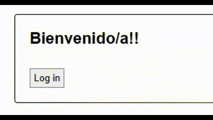

# Ejercicios de práctica
## Importante
Todas las entregas deben realizarse en el foro de tarea correspondiente en el campus de inove, salvo especificarse lo contrario.

## Preparar nuestro entorno de trabajo
Para poder realizar este ejercicio deberá crear un proyecto nuevo, o aprovechar otro que haya utilizado para otro desafio.

## Consigna
Pasos para guiarte:

1. Dentro del componente "App" importa la función useState de React. En el componente crear un estado ```[currentUser, setCurrentUser]``` e inicializalo con {name: ""}
2. Crea una carpeta llamada context con un CurrentUserContext.js. Importa createContext y crea un contexto cuyo valor inicial sea {name:""}, exporta el context llamado "CurrentUserContext".
3. Importa el contexto creado en App. Utiliza el provider el contexto para  prover los valores del useState creado antes a un componente llamado "Form".
4. Crea el componente funcional "LoginButton" con valores por defecto. Crea el componente Form:

```javascript
export default function Form() {
  return (
    <Panel title='Bienvenido/a!!'>
      <LoginButton />
    </Panel>
  );
}
```

5. Al importar Form en App, el componente debería quedar así:

```javascript
export default function App() {
  const [currentUser, setCurrentUser] = useState({ name: "" });

  return (
    <CurrentUserContext.Provider
      value={{
        currentUser,
        setCurrentUser,
      }}
    >
      <Form />
    </CurrentUserContext.Provider>
  );
}
```

5. Crea el componente llamado "Panel":

```javascript
export default function Panel({ title, children }) {
  return (
    <section className='panel'>
      <h1>{title}</h1>
      {children}
    </section>
  );
}
```

6. En el archivo "Button.jsx", crea un componente funcional llamado "Button" que acepte las propiedades "children" y "onClick" y exportalo como valor por defecto. Cambia "(Tu nombre)" por tu nombre.

```javascript
export default function Button({ children, onClick }) {
  return (
    <button className='button' onClick={onClick}>
      {children}
    </button>
  );
}
```

7.  En LoginButton agrega el código a continuación. Usa el contexto CurrentUserContext.

```javascript
export default function LoginButton() {
  const { currentUser, setCurrentUser } = useContext(CurrentUserContext);

  if (currentUser.name !== "") {
    return <p>Hola {currentUser.name}, te esperábamos.</p>;
  }

  return (
    <Button
      onClick={() => {
        setCurrentUser({ name: "(Tu nombre)" });
      }}
    >
      Log in
    </Button>
  );
}
```

8. Borra App.css. En index.css establece los siguientes estilos:

```css
body {
  font-family: sans-serif;
}

.panel {
  border: 1px solid black;
  border-radius: 4px;
  padding: 20px;
  margin-bottom: 10px;
}
```

Se utilizó useContext para compartir el estado del usuario actual entre componentes, se practicó la estructura y organización de componentes, la creación de contextos y proveedores, así como el consumo del contexto en componentes hijos.

## Resultado final


