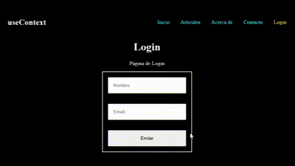

# Ejercicios de práctica
## Importante
Todas las entregas deben realizarse en el foro de tarea correspondiente en el campus de inove, salvo especificarse lo contrario.

## Preparar nuestro entorno de trabajo
Para este desafio deberá continuar trabajando sobre el proyecto del desafio anterior, o puede crear uno nuevo como copia del anterior.

## Consigna
Implementar el uso de useContext para guardar y mostrar el nombre del usuario en la barra de navegación después de iniciar sesión, y permitir cerrar sesión para borrar los datos del usuario.

Pasos para guiarte:

1. Crear el archivo PruebaContext.js en la carpeta context y agregar el siguiente código:

```javascript
import { createContext } from "react";

export const PruebaContext = createContext({
  user: { nombre: "", email: "" },
  setUser: () => {},
});
```

2. Abrir el archivo App.js y realizar las siguientes modificaciones:

- Importar el contexto PruebaContext.
- Dentro del componente App, agregar el estado "user" y la función "setUser" utilizando useState:

```javascript
const [user, setUser] = useState({ nombre: "", email: "" });
```

- Crear dos useEffect, dentro del primero, obtener el usuario almacenado en el localStorage y actualizar el estado user si existe:

```javascript
useEffect(() => {
  const storedUser = localStorage.getItem("usuario");
  if (storedUser) {
    setUser(JSON.parse(storedUser));
  }
}, []);
```

- Dentro del segundo useEffect, guardar el usuario en el localStorage cada vez que se actualice el estado user:

```javascript
useEffect(() => {
  localStorage.setItem("usuario", JSON.stringify(user));
}, [user]);
```

- Envolver el componente AppRouter con el proveedor PruebaContext.Provider y pasar el valor del contexto:

```javascript
<PruebaContext.Provider value={{ user, setUser }}>
  <AppRouter />
</PruebaContext.Provider>
```

3. Crear el archivo AppRouter.jsx en la carpeta routes y agregar el siguiente código:

```javascript
import { useContext } from "react";
import { PruebaContext } from "../context/PruebaContext";
import {
  BrowserRouter as Router,
  Routes,
  Route,
  NavLink,
} from "react-router-dom";
import {
  Inicio,
  Articulos,
  Acerca,
  Contacto,
  Login,
  Error404,
} from "../components/index";

export default function AppRouter() {
  const { user, setUser } = useContext(PruebaContext);

  return (
    <>
      <Router>
        <nav>
          <h2>useContext</h2>
          <ul>
            <li>
              <NavLink
                to='/'
                className={({ isActive }) => (isActive ? "active" : "")}
              >
                Inicio
              </NavLink>
            </li>
            <li>
              <NavLink
                to='/articulos'
                className={({ isActive }) => (isActive ? "active" : "")}
              >
                Articulos
              </NavLink>
            </li>
            <li>
              <NavLink
                to='/acerca-de'
                className={({ isActive }) => (isActive ? "active" : "")}
              >
                Acerca de
              </NavLink>
            </li>
            <li>
              <NavLink
                to='/contacto'
                className={({ isActive }) => (isActive ? "active" : "")}
              >
                Contacto
              </NavLink>
            </li>
            {user.nombre && user.nombre !== "" ? (
              <>
                <li>
                  <span>{user.nombre}</span>
                </li>
                <li>
                  <NavLink
                    to='/login'
                    className={({ isActive }) => (isActive ? "active" : "")}
                    onClick={() => setUser({ nombre: "", email: "" })}
                  >
                    Cerrar sesión
                  </NavLink>
                </li>
              </>
            ) : (
              <li>
                <NavLink
                  to='/login'
                  className={({ isActive }) => (isActive ? "active" : "")}
                >
                  Login
                </NavLink>
              </li>
            )}
          </ul>
        </nav>

        <Routes>
          <Route path='/' element={<Inicio />} />
          <Route path='/articulos' element={<Articulos />} />
          <Route path='/acerca-de' element={<Acerca />} />
          <Route path='/contacto' element={<Contacto />} />
          <Route path='/login' element={<Login />} />
          <Route path='*' element={<Error404 />} />
        </Routes>
      </Router>
    </>
  );
}
```

5. Crear los archivos Inicio.js, Error404.js, Contacto.js, Articulos.js y Acerca.js en la carpeta components con el siguiente contenido respectivamente:

```javascript

export default function Inicio() {
  return (
    <div>
      <h1>Inicio</h1>
      <span>Pagina de Inicio</span>
    </div>
  );
}
export default function Contacto() {
  return (
    <div>
      <h1>Contacto</h1>
      <span>Pagina de Contacto</span>
    </div>
  );
}

export default function Error404() {
  return <h1>Error404 - Page not found</h1>;
}
```

8. Crear el archivo Login.jsx en la carpeta components y agregar el siguiente código:

```javascript
import { useContext } from "react";
import { PruebaContext } from "../context/PruebaContext";

export default function Login() {
  const { setUser } = useContext(PruebaContext);
  function handleSubmit(e) {
    e.preventDefault();

    const obj = {
      nombre: e.target.nombre.value,
      email: e.target.email.value,
    };
    setUser(obj);
  }

  return (
    <>
      <h1>Login</h1>
      <span>Página de Login</span>
      <div className='formulario'>
        <form onSubmit={handleSubmit} className='login'>
          <input type='text' placeholder='Nombre:' name='nombre' />
          <input type='email' placeholder='Email:' name='email' />
          <input type='submit' value={"Enviar"} />
        </form>
      </div>
    </>
  );
}
```

8. Extra: importe useNavigate() de react-router-dom en Login.jsx para redirigir al usuario al inicio una vez se haya logeado.

9. Borra App.css. En index.css agrega los siguientes estilos:

```css
body {
  font-family: "Roboto";
  background-color: black;
  color: white;
}

.active {
  color: yellow;
}

nav {
  display: flex;
  justify-content: space-evenly;
  align-items: center;
}
ul {
  display: flex;
  list-style: none;
  text-decoration: none;
}
li {
  margin-left: 2rem;
  opacity: 1;
}
li:hover {
  opacity: 0.5;
}
nav ul li a {
  text-decoration: none;
  color: cyan;
}
div {
  text-align: center;
}
.login {
  display: flex;
  flex-direction: column;
  align-content: center;

  border: white solid 2px;
  width: 20%;
  height: 20%;
}
.login input {
  display: block;
  padding: 15px;
  margin: 15px;
}
.formulario {
  display: flex;
  justify-content: center;
  margin: 15px;
}
```

Se utilizó useContext para compartir para acceder a un contexto, guardar y mostrar datos en la barra de navegación, y a utilizar el localStorage para persistir los datos del usuario. Además, repasó el uso de useState para manipular el estado, React Router para la navegación y la interacción con formularios en React.

## Resultado final



